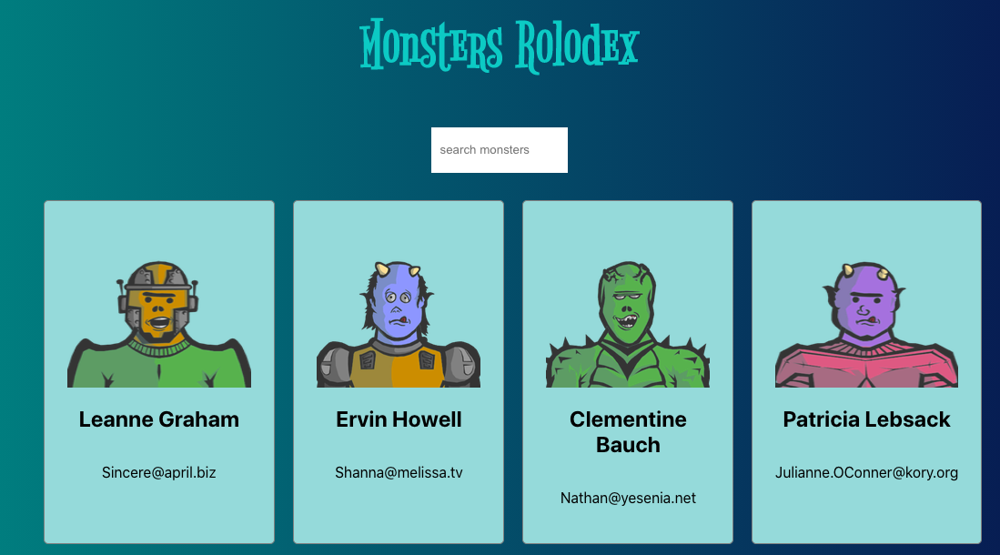

# Monsters-Rolodex

## Description

This is a simple web application that displays information for different monsters.

## Table of Contents

* [Description](#description)
* [Technology](#technology)
* [User Story](#user-story)
* [Installation](#installation)
* [Usage](#usage)
* [License](#license)
* [Contributing](#contributing)
* [Tests](#tests)
* [Questions](#questions)
* [Deployed Application URL](#deployed-application-URL)

## Technology
- React
- Javascript
- HTML
- CSS

## User Story

## Installation

No installation needed. 

## Usage

The deployed application link will take you to the homepage. 

## License

## Contributing

Please follow standard contributing guidelines.

## Tests

No tests to run.

## Questions

For any questions, please contact kendayao at kendayao@gmail.com

## Deployed Application URL

Deployed application link: https://kendayao.github.io/Monsters-Rolodex/

